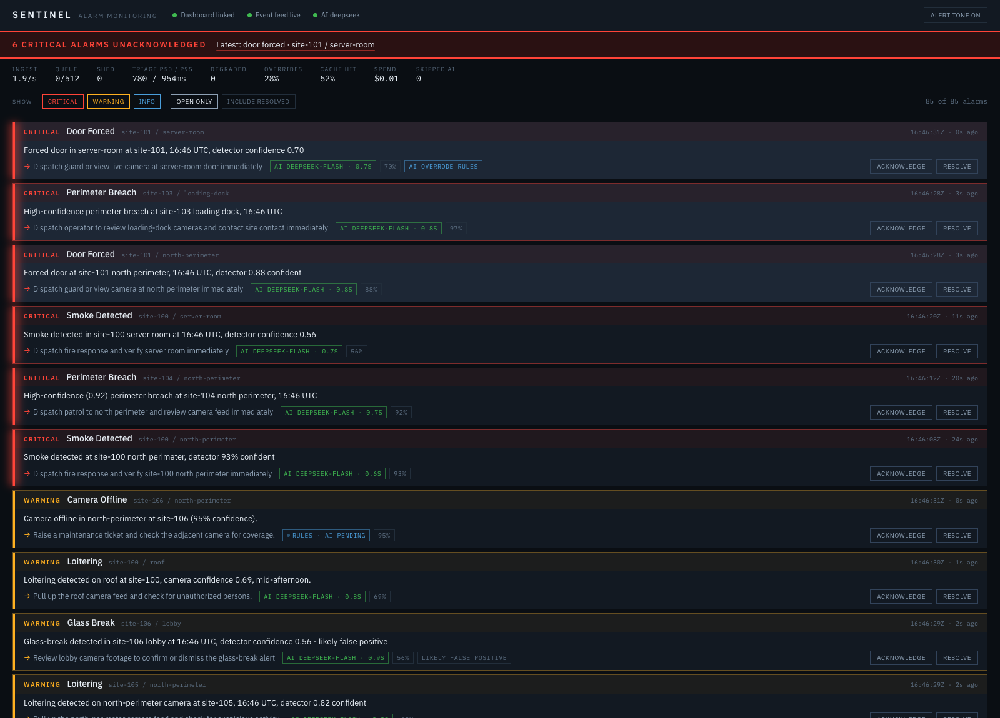

# Project Sentinel

A miniature real-time alarm monitoring service: it ingests a live stream of
security events, turns a camera feed into detection events, triages everything
through an LLM, and presents it to an operator on a live dashboard where
critical situations are impossible to miss.

Built for the Monitex AI & Systems Developer technical assessment.

> **Status: Phase 3 of 5 complete** — ingest, AI triage, and the operator
> dashboard all run end to end. See [Roadmap](#roadmap) for what remains.



---

## Quick start

Requires Python 3.11+ and [uv](https://docs.astral.sh/uv/) (or plain `pip`).

```bash
# 1. install
uv venv && uv pip install -e ".[dev]"
cp .env.example .env
(cd frontend && npm install && npm run build)

# 2. start the event feed (terminal 1)
.venv/bin/python scripts/loadgen.py --rate 2      # realistic event mix
# or: .venv/bin/python stream.py                  # the generator from the brief

# 3. start the service (terminal 2) - serves the API and the dashboard
.venv/bin/python -m backend.main
```

Open **http://localhost:8000/**.

For frontend development, run Vite separately and it proxies the API:

```bash
cd frontend && npm run dev     # http://localhost:5173
```

**On which generator to use.** `stream.py` is the reference generator, committed
verbatim, and it picks event types *uniformly at random* — so roughly a third of
its feed is a fire alarm or panic button and the board becomes a wall of red.
`scripts/loadgen.py` uses the same schema with realistic weights, which produces
about **5% critical, 48% warning, 48% info** — noise with the occasional real
emergency buried in it. That is the problem this system exists to solve, so it
is the better demo. Both work.

To use a real LLM, set the key and pick a provider:

```bash
export DEEPSEEK_API_KEY=sk-...        # or OPENAI_API_KEY
SENTINEL_LLM_PROVIDER=deepseek .venv/bin/python -m backend.main
```

Without a key you can still exercise the entire production code path — real
provider class, real retries, real circuit breaker — against a local mock:

```bash
.venv/bin/python scripts/mock_openai.py --latency-ms 400        # terminal 3
SENTINEL_LLM_PROVIDER=openai SENTINEL_LLM_BASE_URL=http://localhost:8900/v1 \
  OPENAI_API_KEY=sk-local .venv/bin/python -m backend.main
```

The mock can inject failures on demand (`--fail-rate`, `--rate-limit-rate`,
`--junk-rate`), which is how the numbers in
[Behaviour when the LLM misbehaves](#behaviour-when-the-llm-misbehaves) were
produced.

Then:

```bash
curl localhost:8000/api/health
curl localhost:8000/api/alarms
curl -N localhost:8000/api/stream        # live SSE feed
```

Run the tests:

```bash
.venv/bin/python -m pytest -q --cov=backend
```

### Load testing

`stream.py` emits about one event per second, which never stresses the queue.
`scripts/loadgen.py` speaks the same schema at an arbitrary rate and mixes in
malformed frames and missing fields:

```bash
.venv/bin/python scripts/loadgen.py --rate 600        # instead of stream.py
SENTINEL_STUB_LATENCY_MS=300 .venv/bin/python -m backend.main
```

See [Behaviour under load](#behaviour-under-load) for what that produces.

---

## Architecture

```
  stream.py ──WS──┐
  (or loadgen)    │
                  ├──> EventIntake ──> bounded queue ──> triage workers ──> AlarmStore ──SSE──> dashboard
  video worker ───┘    (rules,          (backpressure)    (LLM + rule         (ring buffer
  [Phase 4]             instant)                           fallback)           + fan-out)
```

Every event walks through the same door. `EventIntake.accept()` is shared by the
WebSocket feed and (in Phase 4) the camera worker, so a camera detection is
triaged, ranked, and escalated by exactly the same code as a sensor alarm. There
is no second path to keep in sync.

### Two-stage triage

This is the central design decision. Each event is classified **twice**:

1. **Instantly, by rules.** A deterministic classifier assigns severity in
   microseconds and the alarm hits the operator board immediately, marked
   `preliminary`. No operator ever waits on an API call.
2. **Then, by the LLM.** The record is queued for enrichment; when the verdict
   returns it replaces the preliminary one in place, marked `final`.

Measured under 45× overload, the time from an alarm arriving to a ranked,
actionable verdict on the board had a **p50 of 0.0 ms** — while the LLM queue was
27 seconds deep. The operator's view stays live no matter what the AI layer is
doing.

Two further consequences:

- **Unambiguous alarms skip the LLM entirely.** `fire_alarm` and `panic_button`
  are critical by definition; a language model cannot improve on that, so they
  are published as final immediately and cost nothing. Roughly 1.5% of feed
  volume, but the most important 1.5%.
- **The fallback is already written.** When the LLM times out, rate-limits, or
  returns junk, the same rule engine produces the verdict, flagged `degraded`.
  The operator sees a ranked alarm with a recommended action, never an error.

### The AI layer

Currently **DeepSeek `deepseek-flash`**; OpenAI `gpt-4o-mini` is a one-setting
switch. One adapter (`triage/openai_compatible.py`) serves both, written against
the HTTP API with `httpx` rather than an SDK — the timeout, retry, and breaker
behaviour is the interesting part and it should be legible in one file instead
of buried in a vendor library's defaults. Per-vendor quirks live in
`triage/presets.py`; the adapter itself has no vendor names in it.

**"OpenAI-compatible" is not "identical".** Two differences were load-bearing
enough to shape the design, and both were found by probing the API rather than
trusting the label:

| | OpenAI | DeepSeek |
|---|---|---|
| Strict `json_schema` | supported | **rejected** — `"This response_format type is unavailable now"` |
| Reasoning tokens | none | `deepseek-flash` thinks before answering |

*Structured output.* Against OpenAI the schema is enforced server-side. DeepSeek
offers only `json_object`, which guarantees valid JSON but not the right
*shape* — so in that mode the schema is described in the prompt instead, and the
response validator is what actually holds the contract. That validator was
already there, which is the point: casing drift is normalised, unknown
severities rejected, empty fields rejected, long fields truncated. "The API
guarantees it" is not worth relying on when the alternative is an operator
staring at a blank alarm.

*Reasoning.* `deepseek-flash` is a reasoning model, and left alone it spends most
of its output budget thinking. Measured on one triage event:

| Config | Latency | Output tokens | Verdict |
|---|---|---|---|
| default | 3125 ms | 471 (333 reasoning) | critical |
| `reasoning_effort: none` | **1084 ms** | **126 (0 reasoning)** | critical |
| `max_tokens: 200` | 1534 ms | truncated mid-JSON | **failed** |

Reasoning is disabled. Alarm triage is classification under latency pressure,
not a reasoning task, and the rule engine already hands the model a baseline to
react to — 3× the latency bought nothing. The `max_tokens: 200` row is why the
default is now 700: a reasoning model silently overruns a tight budget and cuts
the JSON mid-string, which would have failed *every* call.

**The model gets the rule verdict as a baseline.** It encodes site policy the
model cannot infer and gives it something to react to rather than guess from
cold. The model is told it may override, and disagreements are tracked as
`llm_overrides`: a model that never overrides is not earning its cost, and one
that always overrides is miscalibrated. Observed override rate on the mock feed
is 10–20%.

**Event content is untrusted.** `metadata` and `zone` come from cameras and
third-party sensors and are attacker-influenceable. They are fenced inside an
`<event>` block, truncated, and the system prompt says not to take instructions
from them.

**Cost.** Measured over a live 60-second run on `deepseek-flash`:

```
49 llm calls   0 failures   p50 960ms   p95 1219ms
cache hit rate 39%          $0.000178 per call       $0.17 per 1000 events
```

The cache hit rate is worth the line item. The system prompt is identical on
every call, so after the first request the provider serves most of the input
from its prompt cache — **$0.006 per 1M tokens against $0.30**, a 50× difference
on the bulk of each request. Both providers report it in `usage` (OpenAI nests
it, DeepSeek does not), so the adapter reads both shapes and bills accordingly.

Fast-path alarms cost nothing at all. Unpriced models report tokens and **no
cost** rather than a fabricated figure — an honest blank beats a made-up number
on something an operator might budget from.

### Failure handling, cheapest first

| Condition | Behaviour |
|---|---|
| Circuit open | Never calls the API. Instant rule fallback. |
| `401` / `400` / `404` | Fails immediately — a bad key will not fix itself. |
| `429` / `5xx` / timeout / network | Bounded retries, exponential backoff with jitter, honours `Retry-After`. |
| Malformed or schema-violating output | Treated as failure, never passed through. |
| Anything else | Rule fallback, flagged `degraded` in the UI. |

Every path ends in a ranked, actionable verdict. There is no branch where an
operator gets an error instead of an alarm.

The circuit breaker matters more than it looks. Without it, a dead provider
makes *every* alarm pay the full timeout before falling back, the queue backs
up, and the board goes stale — the failure spreads from the AI layer into the
thing that has to keep working.

### Behaviour when the LLM misbehaves

Measured against the mock, live:

**80% of responses failing** (40% `500`, 20% `429`, 20% malformed-with-`200`):

```
llm_calls 48   llm_failures 4   p50 305ms   p95 1288ms
board: every alarm has a summary and a recommended action
```

Retries absorbed all but 4. The breaker correctly stayed closed — failures were
not *consecutive*.

**Provider 100% down:**

```
events_ingested 91   events_triaged 91   llm_degraded 27   circuit: open
```

Every event still got a verdict. The decisive check: a freshly started mock
reported `{"calls": 0}` while the breaker was open — the open circuit stopped
touching the network entirely rather than merely discarding the results.

**Provider recovers:** the circuit closed on its own and LLM verdicts resumed
with no restart and no intervention.

### What the model actually adds

Live overrides of the rule baseline, unedited:

> `object_detected` · vehicle · server-room · conf 0.50 → **warning**
> *"Vehicle in a server room is implausible, suggesting a likely false positive
> despite the unusual zone"*

> `motion_detected` · server-room · conf 0.48 → **warning** (rules said `info`)
> *"server-room zone outweighs sub-0.5 confidence, so operator should look
> within minutes"*

> `glass_break` · lobby · conf 0.85 · 16:00 → **warning** (rules said `critical`)
> *"High-confidence glass break in lobby during business hours is likely real
> but not clearly an active intrusion"*

Reasoning over the *combination* of object, zone, confidence, and time is the
thing a lookup table cannot do. Observed override rate: 13–22%.

### Severity is not a lookup table

The brief notes that event type alone does not determine severity. The rules
account for detector confidence and time of day:

| Event | Confidence | Time | Severity |
|---|---|---|---|
| `motion_detected` | 0.38 | 13:00 | `info` — noise |
| `motion_detected` | 0.95 | 13:00 | `info` — still just motion at noon |
| `loitering` | 0.88 | 13:00 | `warning` |
| `loitering` | 0.88 | 03:00 | `critical` — after hours |
| `door_forced` | 0.95 | 13:00 | `critical` — confident forced entry |
| `perimeter_breach` | 0.20 | 13:00 | `info` — detector is guessing |
| `fire_alarm` | 0.35 | any | `critical` — always |

Confidence only escalates *forced-entry* types. High confidence means the
detector is sure **what** it saw, not that what it saw is an emergency — a
confidently-detected loiterer is still just a loiterer.

### Load shedding policy

"Never block, never drop, never crash" cannot all hold at the extreme, so the
policy is explicit and tiered:

1. **Normal load** — the queue has room; ingest never stalls.
2. **Burst** — the queue is full, so we wait. The WebSocket read loop stops
   draining, the TCP window closes, and the producer feels real backpressure.
   Nothing is lost.
3. **Sustained overload** — if even that wait times out, the event is shed and
   **counted on the dashboard**, because an unbounded queue only trades a
   visible drop for an invisible OOM.

**Critical alarms are exempt from step 3** and wait as long as necessary. A shed
event also still appears on the board with its rule verdict — only the LLM
enrichment is skipped. That is the honest degradation.

### Behaviour under load

Driving 600 events/sec into 4 workers against 300 ms of emulated LLM latency —
roughly 45× the throughput the triage layer can sustain:

```
events_ingested      683        queue_depth          512 / 512
events_shed            0        backpressure_waits    49
events_malformed       6        events_per_second   13.3
llm_failures           0        triage_p95_ms      301.9
```

Ingest throttled to 13.3 events/sec, which is exactly 4 workers ÷ 300 ms.
Backpressure propagated cleanly from the triage layer through the queue and the
socket all the way back to the producer, and **nothing was lost**. The system
slowed down instead of falling over.

### Why SSE rather than WebSocket for the dashboard

The dashboard only ever receives. SSE reconnects on its own, survives proxies
that mangle upgrades, and needs no framing logic. One less thing to hand-roll.

Subscription registers **before** the initial snapshot is taken. The reverse
order leaves a window where an alarm arriving between snapshot and subscribe is
seen by neither, and is silently lost. This ordering can instead deliver an
alarm twice; the client keys by `event_id`, so a duplicate simply overwrites.
Duplicates are cheap, gaps are not. (`tests/test_api.py` pins this.)

---

## The dashboard

The design borrows from alarm annunciator panels — the backlit legend boards in
real fire and security installations. Red for alarm, amber for trouble, and a
lit lamp on the edge of every card. Severity *is* the information here, so the
colour system is the interface rather than decoration. Type is IBM Plex, drawn
for technical systems, with tabular numerals so confidence values, latencies,
and timestamps line up column-wise and can be compared at a glance.

**Critical alarms cannot be missed.** A pulsing banner counts what is
outstanding and links to the newest one, a two-tone chirp plays for each new
critical (synthesised, mutable, and never fired for anything else — an alert
that goes off for everything trains people to ignore it), and criticals sort to
the top. The banner deliberately ignores the active filters: a filter is a
convenience and must not be able to hide an emergency.

**The two-stage triage is visible.** An alarm appears instantly badged
`Rules · AI pending`, and when the model's verdict lands the card flares briefly
and the badge becomes `AI deepseek-flash · 0.8s`. Watching that happen is the
clearest explanation of the architecture. Every card also says which brain
produced its verdict, because an operator acting on a `Fallback · AI
unavailable` verdict should know the AI was down, and one looking at
`Rules only · no AI cost` should know no model was consulted and none was
needed.

**Other operator-facing details:** `AI overrode rules` marks disagreements with
the baseline; `likely false positive` is called out explicitly; acknowledged
alarms dim and resolved ones sink; the instrument strip carries throughput,
queue depth, shed count, p50/p95, degraded count, override rate, cache hit rate,
and spend. Actions apply optimistically so a click feels instant, with SSE as
the source of truth.

Two connection states are shown separately, because they fail independently:
*Dashboard linked* (this browser to the backend) and *Event feed live* (the
backend to the alarm stream).

Responsive to 420px, keyboard focus visible, and all motion disabled under
`prefers-reduced-motion` — a control room runs for hours.

---

## API

| Method | Path | Purpose |
|---|---|---|
| `GET` | `/api/health` | Liveness, feed connection state, active provider |
| `GET` | `/api/alarms` | Full board, ranked |
| `GET` | `/api/metrics` | Counters for the health strip |
| `GET` | `/api/stream` | SSE: `snapshot`, then `alarm` and `metrics` frames |
| `POST` | `/api/alarms/{id}/acknowledge` | Operator acknowledgement |
| `POST` | `/api/alarms/{id}/resolve` | Operator resolution |

---

## Handling bad input

The feed is treated as untrusted. `normalise_payload` absorbs it at the
boundary so nothing downstream needs defending:

- missing fields → sensible defaults (`unknown` site, generated `event_id`)
- `confidence` as a string, out of range, or `NaN` → coerced, clamped, or `None`
- unparseable timestamps → arrival time
- unknown event types → conservative `warning`, never dropped
- malformed JSON frames → counted, connection kept open

At 600 events/sec with 2% junk injected, 6 malformed frames were counted and the
connection never dropped.

---

## Layout

```
backend/
  models.py        frozen domain models + boundary normalisation
  intake.py        the shared door for sensor and camera events
  pipeline.py      bounded queue, backpressure and shed policy
  ingest.py        WebSocket client with reconnect/backoff
  store.py         ring buffer, operator state, SSE fan-out
  metrics.py       counters for the health strip
  runtime.py       composition root
  api.py           HTTP + SSE surface
  triage/
    rules.py           deterministic classifier (preliminary/fast-path/fallback)
    base.py            provider protocol + stub
    openai_compatible.py adapter for any OpenAI-shaped API
    presets.py         per-vendor deviations (DeepSeek, OpenAI)
    circuit.py         circuit breaker state machine
    prompt.py          prompt construction
    schema.py          structured-output schema + response validation
    factory.py         provider selection
    worker.py          bounded-concurrency triage workers
frontend/
  src/App.tsx            board state, filters, operator actions
  src/useAlarmStream.ts  SSE subscription and verdict-landing detection
  src/components/        status rail, banner, instrument strip, alarm card
  src/lib/               severity ordering, formatting, tone synthesis
scripts/loadgen.py     burst event generator with a realistic event mix
scripts/mock_openai.py local OpenAI stand-in with injectable failures
scripts/shoot.py       screenshot the running dashboard
stream.py          reference generator, supplied with the brief, verbatim
```

---

## Roadmap

- [x] **Phase 1 — pipeline spine.** Ingest, backpressure, store, SSE, operator
      actions.
- [x] **Phase 2 — AI triage.** DeepSeek + OpenAI behind one adapter, structured
      output with validation, timeout/retry/circuit breaker, cache-aware cost
      and override tracking. 145 tests at 94% coverage.
- [x] **Phase 3 — operator dashboard.** React + Tailwind over SSE, live
      severity-ranked board, critical banner with alert tone, acknowledge and
      resolve, instrument strip. 20 frontend tests.
- [ ] **Phase 4 — video worker.** Frame sampling off the hot path, motion/YOLO
      detection emitting into the same pipeline.
- [ ] **Phase 5 — correlation & escalation.** Sliding-window patterns per site.

## Known gaps

Recorded honestly rather than hidden:

- **Dashboard tests cover logic, not rendering.** Board ordering and formatting
  are unit-tested; the components themselves were verified by screenshotting the
  running app rather than with a component test harness. The ordering test
  exists specifically because it duplicates `sort_key` on the server and the two
  must not drift.
- **Cost is an estimate.** Rates live in a table in
  `triage/openai_compatible.py` and drift; DeepSeek also halves them off-peak
  and we quote peak, so the figure over-estimates by design. Override with
  `SENTINEL_LLM_PRICE_IN_PER_M` / `_OUT_PER_M`.
- **No request batching.** Prompt caching is exploited (39% hit rate measured),
  but each event is still its own call. At real volume, batching low-severity
  events would be the next lever.
- **No persistence.** The store is an in-memory ring buffer; restarting loses
  history. Deliberate for a monitoring surface, and the interface is ready for
  a SQLite backing store.
- **No auth.** The dashboard is unauthenticated and binds to localhost.
- **`stream.py` is committed verbatim**, including its deprecated
  `datetime.utcnow()`, so the reviewer can reproduce the feed exactly.
